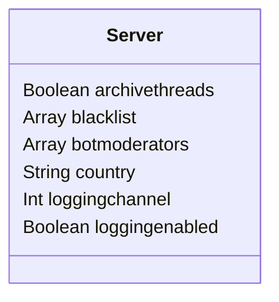
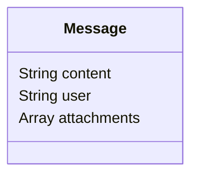

  

## Outline
When a message is sent to a server the bot will look at the message content, 
attachments, user who sent it, embeds, channel it was sent in, and every other part 
of the message then takes the information then adds it as a document in the 
server’s archival collection. Then the archive can be accessed by logging on to 
the website and selecting the server that you want to see, bot moderators can change 
the public visabilly of messages sent in channels or categories, but can not delete a 
log. The server owner can delete archived messages, but only about 15 per hour, or unlimited with premium. 

## Goals
The point of Archiver Bot is to allow more transparency with the server, 
seeing as how if you delete something off a Discord there really is no way 
to get it back, unless you rely on screenshots. And since the archives audit 
log is open to public*, anyone can see the messages that have been sent in a server and see if people are lying.

## Website
The website is basically the heart of Archiver Bot, this is where people can see 
the servers archive, if they are a bot moderator, and change the servers settings. 
Most of the time people will access the archive by doing, /archive, that will send a 
link in chat to that server's archive, for example, https://www.domainnamehere.xyz/serverid. 
The page will have in a list the messages sent with a table arrangement, each message’s table 
id corresponds to the Discord message id. This page will also have a button for seeing the server’s 
Archiver Bot audit log, to see if any message has been deleted.

## Monetization
The way I'm thinking about monetizing Archiver Bot in the beginning is to have a set limit of how 
many messages can be Archived, let's say 500, after that the server will have to upgrade to premium. 
There will be 2 tiers of premium, tier 1 will increase the amount of messages to 10,000 excluding the any 
messages already sent, this could be around $0.99 per month or $12 a year. Tier 2 will allow for unlimited 
messages and will even store the attachments off Discord, this could be around $5 per month or $60 a year. 
Or for a one time payment of $100 you will get tier 2 for life, this might change in the future. 
All of this pricing is subject to Firebase, and it's pricing.

## Design
The main thing of Archiver Bot is the database or backend. This will, for the foreseeable future, be hosted on Firebase. 
We could at some point in time when we have enough people and money we could migrate over to Google Cloud or AWS. 
For the language of the server, we will be using Typescript. The document schema for the server doc will be,

## Commands
^ Denotes required options 
 
/start county^ enable_logging^ | logging_channel - The command the sets up everything for the Bot in a server 
/blacklist add channel^ - Adds the given channel to the servers blacklist 
/blacklist remove channel^ - Removes the given channel from the servers blacklist 
/archive - Gives the user the link to that servers archive 
/help option - Show the help page, if option given then show that command help page 
* Settings Commands: 
  * /settings - Shows embed of the all settings 
  * /settings logging option^ - Sets logging to the given option 
  * /settings bot_mod add member^ - Adds the given member as bot moderator 
  * /settings bot_mod remove member^ - Removed the given member as a bot moderator 
  * /settings logging_channel channel^ - Sets the given channel as the logging channel. 
  * /settings visibility option^ - Sets the visibility of the server archive 
  * /settings premium - Responds if the server has premium 
